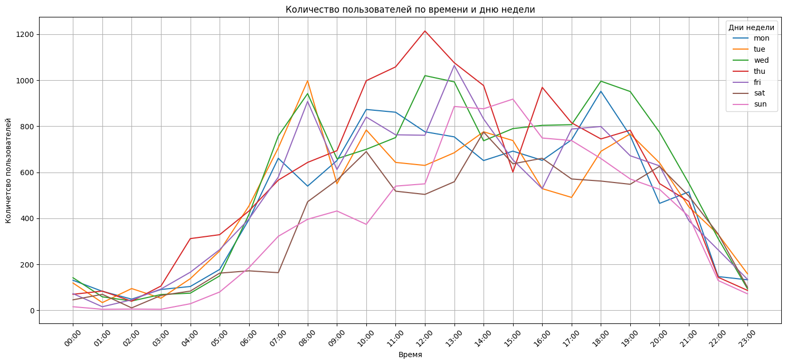

## **Задание 1**
```sql
with count_diff as(
   select
		    u.id,
		    (date(u2.entry_at) -date(date_joined))::integer as diff,
		    to_char(date_joined, 'YYYY-MM') as dt_reg
   from users u
   join userentry u2
   on u2.user_id = u.id
	    ),
count_users as(
	select 
		dt_reg,
		count(distinct case when diff >= 0 then id else null end) as days_0,
		count(distinct case when diff >= 1 then id else null end) as days_1,
		count(distinct case when diff >= 3 then id else null end) as days_3,
		count(distinct case when diff >= 7 then id else null end) as days_7,
		count(distinct case when diff >= 14 then id else null end) as days_14,
		count(distinct case when diff >= 30 then id else null end) as days_30,
		count(distinct case when diff >= 60 then id else null end) as days_60,
		count(distinct case when diff >= 90 then id else null end) as days_90
	from count_diff
	group by dt_reg
	order by dt_reg
)
select 
	dt_reg,
	round(days_0::numeric / days_0 * 100, 2) as days_0,
	round(days_1::numeric / days_0 * 100, 2) as days_1,
	round(days_3::numeric / days_0 * 100, 2) as days_3,
	round(days_7::numeric / days_0 * 100, 2) as days_7,
	round(days_14::numeric / days_0 * 100, 2) as days_14,
	round(days_30::numeric / days_0 * 100, 2) as days_30,
	round(days_60::numeric / days_0 * 100, 2) as days_60,
	round(days_90::numeric / days_0 * 100, 2) as days_90
from count_users
```
#### Выводы:
За июль, август и сентябрь 2021 года показатели активности студентов достаточно хорошие: даже спустя 90 дней доля активных студентов колеблется от 100% до 50%. Однако, начиная с октября, наблюдается падение этих показателей во всех когортах. Падение в первую неделю можно объяснить тем, что студенты еще знакомятся с курсом и не успевают перейти к практическим задачам. Но спустя неделю и в дальнейшем хотя бы половина студентов должна проявлять активность для закрепления знаний на практике.

**Возможные проблемы:**
1. Неудобство платформы. Переход с одного сайта на другой и слишком большое количество кликов всегда уменьшает долю пользователей, достигающих нужной точки.
2. Возможные баги на сайте при написании кода.
3. Легкодоступные ответы могут снижать интерес. Пользователь может просто заглянуть в ответы, не пытаясь решить задачи самостоятельно.
4. Слабая мотивация.

**Рекомендации по сроку подписки:**
Что касается срока подписки, то это очень важный вопрос. Слишком короткий срок (меньше 7 дней) не даст пользователям возможности полноценно ознакомиться с платформой, а слишком длинный (полгода или год) может отпугнуть. Оптимальным сроком будет 14-30 дней. Также можно предложить 3-4 дня тестового режима, а затем подписку на месяц.

**Рекомендации по решению проблем:**
- **По пункту 1:** Следует попробовать уменьшить количество кликов. Например, при переходе в раздел "практические задачи" должна открываться одна страница с готовым блоком заданий.
- **По пункту 2:** Следует проверить, все ли работает корректно. Не забывать об этом для мобильной версии.
- **По пункту 3:** Готовые решения показывать только после выполнения задания, как образец. В блоке подсказок добавить комментарии, чтобы студенты могли спрашивать совета друг у друга.
- **По пункту 4:** Можно добавить XP для каждого пользователя и какой-нибудь блок с рейтингом (например, недельный). Всегда приятно увидеть себя в первой десятке. В качестве примера можно использовать приложение Duolingo.
Также необходимо провести опрос среди студентов, чтобы получить обратную связь (что понравилось, что нет, что хотелось бы улучшить).
## **Задание 2**
```sql
with count_deb_accr as (
	select
		sum(case when type_id in (1, 23, 24, 25, 26, 27, 28, 30) then value else 0 end) as debiting,
		sum(case when type_id not in (1, 23, 24, 25, 26, 27, 28, 30) then value else 0 end) as accruals
	from transaction
	group by user_id
)
select
	round(avg(accruals), 2) as avg_accruals,
	round(avg(debiting), 2) as avg_debiting,
	round(avg(accruals - debiting), 2) as avg_balance,
	percentile_cont(0.5) within group(order by (accruals - debiting)) as median_balance
from count_deb_accr
```
#### Выводы:
* Среднее начисление 306,5
* Среднее списание 31
* Средний баланс 275
* Медианный баланс 62

Между медианой и средним по балансу большая разница, что свидетельствует о том, что есть выбросы. Если посмотреть на медиану по списаниям (она выходит 30) то она близка к среднему, а вот медиана по начислениям в 2 раза меньше средней по начислениям(100). Значит наш разброс между медианой и средним по балансу появился из-за того, что есть пользователи, которые проявляют большую активность и зарабатывают много коинов. По показателям видно, что пользователи проявляют низкую активность в трате коинов.
*Рекомендации:*
1. Необходимо изучить на что тратят пользователи коины и как часто. Определить какие виды задач или тестов наиболее привлекательны для пользователей.
2. Нужно расширить ассортимент задач и опций на которые можно будет потратить коины. Продумать более ценные вознаграждения и стимулы
3. Нужно повысить вовлеченность. Этого можно достигнуть за счет введения соревнований, рейтингов и общения среди пользователей. 
4. Нужно проанализировать сколько в среднем коинов может заработать очень активный пользователь и сравнить это с показателями реальных пользователей. Чтобы какую долю от возможной прибыли получают пользователи с максимальной активностью по данным и со средней. 
5. А также нужно проанализировать причины по которым пользователи перестают получать или тратить коины.
```sql
with d as (
	select
		sum(value) as sum_d
	from "transaction" t
	where type_id in (1, 23, 24, 25, 26, 27, 28, 30)
	group by user_id),
a as (
	select
		sum(value) as sum_a
	from "transaction" t
	where type_id not in (1, 23, 24, 25, 26, 27, 28, 30)
	group by user_id)
select
	percentile_disc(0.5) within group (order by sum_d) as avg_deb,
	(select 
		percentile_disc(0.5) within group (order by sum_a) as avg_accr
	 from a)
from d
```
## **Задание 3**
```sql
with cnt_users_per_tasks as(
	select
		count(*) as cnt
	from(
		select
			user_id
		from coderun c
		union
		select
			user_id
		from codesubmit	
		union
		select
			user_id
		from teststart) j),
union_tables as (
	select
		user_id,
		problem_id
	from coderun c
	union all
	select
		user_id,
		problem_id
	from codesubmit c2),
cnt_problem_by_users as(
	select
		user_id,
		count(distinct problem_id) as cnt_problem_id
	from union_tables
	group by user_id),
avg_attemp_per_problem as(
	select
		round(avg(avg_cnt), 2) as avg_attemp_problem_id
	from(
		select
			distinct(user_id),
			avg(cnt) over (partition by user_id) as avg_cnt
		from(
			select
				user_id,
				count(problem_id) as cnt
			from union_tables
			group by user_id, problem_id) a)
			 b),
cnt_test_by_users as(
		select
			user_id,
			count(distinct test_id) as cnt_test
		from teststart t
		group by user_id),
avg_attemp_per_test as (
	select
		round(avg(cnt_t), 2) as avg_attemp_test
	from(
		select
			user_id,
			count(test_id) as cnt_t
		from teststart t
		group by user_id, test_id)t1)
select
	round(avg(cnt_problem_id), 2) as avg_cnt_problem,
	(select
		round(avg(cnt_test), 2) as avg_cnt_test
	from cnt_test_by_users),
	(select
		avg_attemp_test
	from avg_attemp_per_test),
	(select
		avg_attemp_problem_id
	from avg_attemp_per_problem),
	(select
		round((cnt::numeric / (select count(*) as cnt_all_us from users u)) * 100, 2) as per_users_complete_tasks
	from cnt_users_per_tasks)
from cnt_problem_by_users
```
#### Выводы:
В среднем пользователи решают ~9 задач (9,18), тестов решают ~2 (1,68), тратят ~ 10 попыток на решение задачи (9,68), на решение тестов тратят ~1 попытку (1,16). Доля пользователей, которые решают либо тесты, либо задачи, либо все вместе, составляет 63,5%. 
В среднем тесты даются пользователям проще, так как в среднем все решают их с первой попытки. Разброс попыток на решение задач очень большой (у кого-то 1 попытка, а у каких-то пользователей достигает 57 попыток). Это говорит о том, что есть доля студентов у которых задачи вызывают сложности. Такие студенты могут разочароваться в обучение и перестать выполнять задачи на платформе. Надо провести анализ какие-именно задачи вызывают трудности у студентов и возможно провести вебинар или уделить в теории больше времени данной теме. Это поможет удержать студентов и повысить долю тех студентов, которые будут возвращаться на платформу для дальнейшего решения задач.
В бесплатном функционале можно оставить:
* 1 попытку на прохождение теста 
* 10 попыток на прохождение задач
```sql
with transaction_filter as(
	select
		user_id,
		type_id,
		count(*) as cnt
	from transaction
	where type_id in (23,24,25,27) and value > 0
	group by user_id, type_id) --отбираем только нужные транзакции и считаем количество с разбивкой по пользователям и типу
select
	sum(case when type_id = 23 then 1 else 0 end) as cnt_users_open_tasks, -- сколько пользователей открыло задач
	sum(case when type_id = 27 then 1 else 0 end) as cnt_users_open_tests, -- сколько пользователей открыло тесты
	sum(case when type_id = 24 then 1 else 0 end) as cnt_users_open_hints, -- сколько пользователей открыло подсказки
	sum(case when type_id = 25 then 1 else 0 end) as cnt_users_buying_solution, -- сколько пользователей открыли решений
	sum(case when type_id = 23 then cnt else 0 end) as cnt_open_tasks, --сколько открыто задач
	sum(case when type_id = 27 then cnt else 0 end) as cnt_open_tests, --сколько открыто тестов
	sum(case when type_id = 24 then cnt else 0 end) as cnt_open_hints, 
	sum(case when type_id = 25 then cnt else 0 end) as cnt_buying_solution, 
	count(distinct user_id) as users_who_buying,
	(select 
		count(distinct user_id) 
	from transaction 
	where value >= 0) as users_with_transactions
from transaction_filter
```
#### Выводы:
	* 450 пользователя открывало задачи за кодкоины
	* 588 пользователей открывало тесты за кодкоины
	* 52 пользователя открывали подсказки за кодкоины
	* 151 пользователь открывало решения за кодкоины
	* 1589 задач открывали за кодкоины
	* 844 теста открывали за кодкоины
	* 423 решения открывали за кодкоины
	* 117 подсказок открывали за кодкоины
	* 991 пользователь покупал хотя бы что-то из вышеперечисленного
	* 2402 пользователя имеют хотя бы 1 транзакцию
Добавить в платную подписку неограниченный доступ к задачам и тестам. Это может быть основным преимуществом, учитывая высокую активность в этой категории.  
Создать несколько уровней подписки:
* _Базовая подсписка._ Доступ к задачам и тестам.
* _Расширенная подписка_. Все из базовой + доступ к подсказкам и решениям.
* _Полная подписка_. Все из базовой и расширенной + какие-нибудь эксклюзивные материалы (разборы тестовых в компании, несколько индивидуальных консультаций с экспертом, добавить реальные кейсы, основанные на реальных задачах, чтобы можно было применять знания именно на нужной практике и т.п.)

Учитывая разницу между средней и медианной величинами(по балансу, который был расчитан в задании 2), можно предусмотреть такие тарифы:
* Базовый - 50-75 коинов (медианный баланс = 62 коинам, поэтому базовый тариф должен быть доступен для большинства пользователей)
* Расширенная - 100-150 коинов
* Полная - 200-250 коинов (средний баланс 275 коинов, что значит есть пользователи, которым полный тариф также будет доступен)

Было бы здорово, чтобы в подписке пользователи могли отслуживать свой прогресс, а также получать рекомендаци. 
Также оставить пробный период, чтобы привлечь больше пользователей и показать ценность подписки.
Предоставлять бонусы и скидки на подписку для пользователей с высоким рейтингом и активностью. Давать возможность продвинутым пользователям самим предлагать новые задачи и тесты и получать за них какие-нибудь бонусы. (если был предложен действительно стоящий материал)
## **Дополнительное задание**
1. Предлагаю посчитать:
* Количетсво регистраций пользователей по месяцам
* Количетсво пользователей, которые решали задачи по месяцам
* Количетсво зашедших пользователей на сайт по месяцам
```sql
with users_act as(
	select
		to_char(created_at, 'YYYY-MM') as month,
		user_id
	from coderun
	union all
	select
		 to_char(created_at, 'YYYY-MM') as month,
		 user_id
	from codesubmit c  
	union all
	select
		to_char(created_at, 'YYYY-MM') as month,
		user_id
	from teststart t 
	), --соединили все таблицы с активностями и вытащили месяц и год из даты
cnt_reg_users as(
	select
		 to_char(date_joined, 'YYYY-MM') as month,
		 count(distinct id) as cnt_registr
	from users
	group by month), -- считаем количество регистраций по месяцам
cnt_act_users as(
	select
		month,
		count(distinct user_id) as cnt_activities
	from users_act
	group by month), -- считаем активности пользователей по месяцам
cnt_us_inputs as (
	select
		to_char(entry_at, 'YYYY-MM') as month,
		count(distinct user_id) as cnt_users_inputs
	from userentry u 
	group by month)-- считаем заходы на сайт уникальных пользователей по месяцм
select
	cau.month,
	coalesce(cnt_registr,0) as cnt_registr,
	coalesce(cnt_activities, 0) as cnt_activities, 
	coalesce(cnt_users_inputs, 0) as cnt_users_inputs
from cnt_reg_users cru
full join cnt_act_users cau
on cau.month = cru.month
full join cnt_us_inputs cui
on cau.month = cui.month
order by cru.month  --в конечном запросе мы склеили данные о количетсве регистраций, активностей, заходов на сайт с разбивкой по месяцам. Пропуски заменили на значение 0
```
```
month  |cnt_registr|cnt_activities|cnt_users_inputs|
-------+-----------+--------------+----------------+
2021-03|          5|             8|               3|
2021-04|         15|            21|              17|
2021-05|          6|            19|               0|
2021-06|          6|             1|               0|
2021-07|          2|             1|               0|
2021-08|          1|             1|               2|
2021-09|         13|             4|               4|
2021-10|          8|             2|               3|
2021-11|        210|           124|             189|
2021-12|        132|           126|             202|
2022-01|        602|           444|             584|
2022-02|       1058|           803|            1061|
2022-03|        479|           369|             575|
2022-04|        237|           235|             535|
2022-05|          0|            58|             435|
```
Анализируя данные показатели мы видим заинтересованность в продукте по месяцам. Это нужно для того, чтобы в те периоды, когда идет спад спроса, можно было запускать дополнительные акциии. Чтобы привлечь новых пользователей. Очень хорошие показатели были за февраль 22 года. Было много регистраций, активностей. Нужно проанализировать, что послужило такому скачку. Возможно была запущена какая-то акция или удачная реклама, которая привлекла много пользователей. Для того, чтобы запускать платные подписки, нужно получить хороший и достаточно стабильный поток новых пользователей. К примеру в мае 22 года вообще не было регистраций новых пользователей, а старые практически не решали задачи. Что послужило такому резкому спаду?

2. Посчитаем с разбивкой по языкам программирование какие задания и в каком количестве вызывают затруднения у пользователей.
```sql
with difficult_tasks_py as( -- считаем количество неверных ответов по каждой задаче на языке пайтон
	select
		problem_id, 
		name, 
		sum(case when is_false = 1 then 1 else 0 end) as sum
	from codesubmit c
	join language l	
	on c.language_id = l.id
	where language_id = 2
	group by problem_id, name
	order by sum desc
),
difficult_tasks_sql as( -- считаем количество неверных ответов по каждой задаче на языке скл
	select 
			problem_id, 
			name, 
			sum(case when is_false = 1 then 1 else 0 end) as sum
	from codesubmit c
	join language l
	on c.language_id = l.id
	where language_id = 3
	group by problem_id, name
	order by sum desc
) -- далее в запросе отбираем наиболее проблемные вопросы и количетсво неверных ответов по каждому языку (я отобрала те вопросы, на которые неправильных ответов больше, чем в среднем в 1,5 раза)
select 
	 problem_id, 
	 name,
	 sum
from difficult_tasks_sql
where sum > (select avg(sum) from difficult_tasks_py) * 1.5
union all
	select
		 problem_id, 
		 name, 
		 sum
  	from difficult_tasks_py
        where sum > (select avg(sum) from difficult_tasks_py) * 1.5
 ```
 ```
 problem_id|name  |sum|
----------+------+---+
       166|Python|720|
        38|Python|321|
       171|Python|312|
         1|Python|211|
        40|Python|191|
        11|Python|184|
        42|Python|183|
         9|Python|175|
       111|Python|166|
       167|Python|160|
        43|Python|145|
         2|Python|136|
       169|SQL   |649|
       168|SQL   |595|
        69|SQL   |361|
        74|SQL   |233|
        71|SQL   |223|
        63|SQL   |208|
        70|SQL   |208|
       170|SQL   |201|
        76|SQL   |175|
        67|SQL   |153|
       135|SQL   |150|
        68|SQL   |148|
        77|SQL   |146|
        64|SQL   |142|
       123|SQL   |142|
   ``` 
Так как на платформе имеется достаточно большое количество задач, вызывающих трудности, это представляет хорошую возможность для внедрения платной подписки. Для платных подписчиков можно предложить более детализированные и пошаговые подсказки, которые помогут им понять, как выполнить задачу самостоятельно. Также для таких подписчиков можно создать видео- или текстовые разборы задач, где будет показано, как шаг за шагом подойти к решению.
Кроме того, пользователям с базовой подпиской можно выдавать рекомендации перейти на другой тариф, который предоставляет более подробное объяснение решений. Такие рекомендации могли бы находиться рядом с проблемными задачами и подчеркивать ценность повышения тарифа для более глубокого понимания и эффективного обучения.
## **Дополнительное задание 2**
Для выгрузки данных используем SQL-запрос:
```sql
 with a as(
	 select
		to_char(created_at, 'HH24:00') as hour, -- Соединяем все записи об активностях пользователей
		to_char(created_at, 'dy') as day,
		problem_id
	from coderun
	union all
	select
		to_char(created_at, 'HH24:00') as hour,
		to_char(created_at, 'dy') as day,
		problem_id
	from codesubmit c
	union all
	select
		to_char(created_at, 'HH24:00') as hour,
		to_char(created_at, 'dy') as day,
		test_id
	from teststart t
	)
select
	distinct(hour),
	count(case when day ='mon' then problem_id else null end) as mon, -- Считаем по дням с разбивкой по часам количество активностей на сайте
	count(case when day ='tue' then problem_id else null end) as tue,
	count(case when day ='wed' then problem_id else null end) as wed,
	count(case when day ='thu' then problem_id else null end) as thu,
	count(case when day ='fri' then problem_id else null end) as fri,
	count(case when day ='sat' then problem_id else null end) as sat,
	count(case when day ='sun' then problem_id else null end) as sun
from a
group by hour
order by hour
```
Для загрузки данных и построения графика используем такой код:
```python
import pandas as pd
import matplotlib.pyplot as plt
df = pd.read_csv('days_and_time.csv')
df.set_index('hour', inplace=True) # Устанавливаем 'hour' в качестве индекса для удобства
plt.figure(figsize=(15, 7))
for column in df.columns:
    plt.plot(df.index, df[column], label=column) #  Показываем график для всех дней недели
# Настройка графика
plt.xlabel('Время')
plt.ylabel('Количетсво пользователей')
plt.title('Количество пользователей по времени и дню недели')
plt.legend(title='Дни недели')
plt.grid(True)
plt.xticks(rotation=45) # Поворачиваем метки по оси X для удобства чтения
plt.tight_layout() # Для оптимального размещения всех элементов
plt.show()
```

Выводы:
В течение дня пик активности происходит в период с 10:00 до 14:00. Наиболее активны пользователи в среду и четверг. Самая низкая активность наблюдается с 00 часов до 3 часов ночи, своего минимум в это время достигает в воскресенье. Оптимальным временем для добавления нового функционала будет воскресенье в период с 12 до 3 часов ночи. Если такого интервала будет недостаточно для загрузки, то можно продолжить в другие дни в такой же временной интервал. Для всех дней недели этот промежуток является самым низким по показателям активности пользователей
